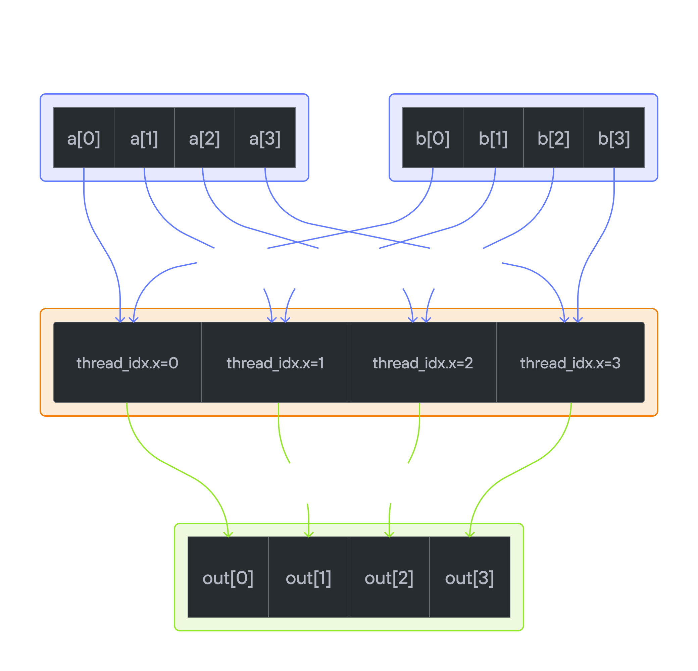
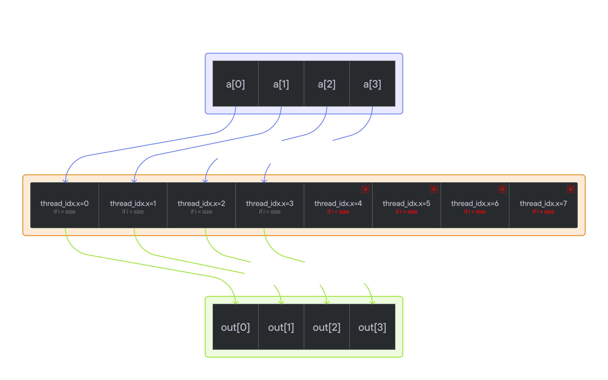

## 🎯 Kernel Tutorial: Adding 10 with Boundary Conditions 🚀

### 🎬 Video Overview
Learn how to implement a CUDA kernel that adds 10 to each element of a vector/matrix, but with a twist - handling cases where you have fewer data elements than threads! 🔥

### 🧠 The Core Concept
📝 What We're Building
A kernel that:

- ✅ Takes input vector/matrix a
- ✅ Adds 10 to each element
- ✅ Stores result in output
- ⚠️ But: Handles boundary conditions when threads > data elements

## Until now



## Today



```mojo
from memory import UnsafePointer
from gpu import thread_idx
from gpu.host import DeviceContext
from testing import assert_equal

alias SIZE = 4
alias BLOCKS_PER_GRID = 1
alias THREADS_PER_BLOCK = (8, 1)
alias dtype = DType.float32

```

```mojo

fn add_10(
    output: UnsafePointer[Scalar[dtype]],
    a: UnsafePointer[Scalar[dtype]],
    size: Int,
):
  
    i = thread_idx.x
     #🛡️ CRITICAL BOUNDARY CHECK!
    if i < size:         # // 🚫 Threads with idx >= n do nothing and return safely
        output[i] = a[i] + 10.0

```

```text
/tmp/mdlab/main.mojo:24:16: warning: deprecated implicit conversion from 'Int' to 'UInt'
        if i < size:         # // 🚫 Threads with idx >= n do nothing and return safely
/tmp/mdlab/main.mojo:1:1: note: '@implicit' constructor 'UInt.__init__' declared here
from memory import UnsafePointer
^
```

```mojo

#BOILER PLATE
var ctx = DeviceContext()
out = ctx.enqueue_create_buffer[dtype](SIZE)
out.enqueue_fill(0)
a = ctx.enqueue_create_buffer[dtype](SIZE)
a.enqueue_fill(0)
with a.map_to_host() as a_host:
    for i in range(SIZE):
        a_host[i] = i

print(a)
```

```text
DeviceBuffer([0.0, 1.0, 2.0, 3.0])
```

```mojo

## call the kernel
ctx.enqueue_function_checked[add_10,add_10](
        out,
        a,
        SIZE,
        grid_dim=BLOCKS_PER_GRID,
        block_dim=THREADS_PER_BLOCK,
    )
print(out)
```

```text
DeviceBuffer([10.0, 11.0, 12.0, 13.0])
```

### 2nd Kernel


```mojo

from gpu import thread_idx, block_idx, block_dim

alias SIZE_2k = 9
alias BLOCKS_PER_GRID_2k = (3, 1)
alias THREADS_PER_BLOCK_2k = (4, 1)
alias dtype_2k = DType.float32


fn add_10_2k(
    output: UnsafePointer[Scalar[dtype]],
    a: UnsafePointer[Scalar[dtype]],
    size: Int,
):
    i = block_dim.x * block_idx.x + thread_idx.x #<<< this is the only change. GEt the index correctly considering multiple blocks
    if i < size:   
        output[i] = a[i] + 10.0  

print("Adding Kernel Here")
```

```text
Adding Kernel Here
```

### 📐 Visual Layout of BLOCKS, THREADS within a GRID

```
Thread  |    0  1  2  3
-------------------------
block 0 | [  0  1  2  3 ]   ← IDs: 0, 1, 2, 3
block 1 | [  0  1  2  3 ]   ← IDs: 4, 5, 6, 7
block 2 | [  0  1  2  3 ]   ← IDs: 8, 9, 10, 11  
block 3 | [  0  1  2  3 ]   ← IDs: 12, 13, 14, 15
```

```mojo
#BOILER PLATE 
var ctx_2k = DeviceContext()
out_2k = ctx_2k.enqueue_create_buffer[dtype_2k](SIZE_2k)
out_2k.enqueue_fill(0)
a_2k = ctx_2k.enqueue_create_buffer[dtype_2k](SIZE_2k)
a_2k.enqueue_fill(0)
with a_2k.map_to_host() as a_2k_host:
    for i in range(SIZE_2k):
        a_2k_host[i] = i

print(a_2k)

```

```text
DeviceBuffer([0.0, 1.0, 2.0, 3.0, 4.0, 5.0, 6.0, 7.0, 8.0])

```

```mojo
#BOILER PLATE 
#CALL KERNEL 2
ctx_2k.enqueue_function[add_10_2k](
            out_2k,
            a_2k,
            SIZE_2k,
            grid_dim=BLOCKS_PER_GRID_2k,
            block_dim=THREADS_PER_BLOCK_2k,
        )
print(out_2k)
```

```text
DeviceBuffer([10.0, 11.0, 12.0, 13.0, 14.0, 15.0, 16.0, 17.0, 18.0])
```

## 3rd Kernel

Apply the 2 priniciples

- convert the local ID -> global ID
- Use the "i<size" but in 2 dimensions


```

┌─────────────────────────────────────┬─────────────────────────────────────┐
│         Block (0,0)                 │         Block (1,0)                 │
│  ┌──────────┬──────────┬──────────┐ │  ┌──────────┬──────────┬──────────┐ │
│  │ B(0,0)   │ B(0,0)   │ B(0,0)   │ │  │ B(1,0)   │ B(1,0)   │ B(1,0)   │ │
│  │ T(0,0)   │ T(1,0)   │ T(2,0)   │ │  │ T(0,0)   │ T(1,0)   │ T(2,0)   │ │
│  │ ───────  │ ───────  │ ───────  │ │  │ ───────  │ ───────  │ ───────  │ │
│  │ a[0,0]   │ a[0,1]   │ a[0,2]   │ │  │ a[0,3]   │ a[0,4]   │ OUT❌    │ │
│  ├──────────┼──────────┼──────────┤ │  ├──────────┼──────────┼──────────┤ │
│  │ B(0,0)   │ B(0,0)   │ B(0,0)   │ │  │ B(1,0)   │ B(1,0)   │ B(1,0)   │ │
│  │ T(0,1)   │ T(1,1)   │ T(2,1)   │ │  │ T(0,1)   │ T(1,1)   │ T(2,1)   │ │
│  │ ───────  │ ───────  │ ───────  │ │  │ ───────  │ ───────  │ ───────  │ │
│  │ a[1,0]   │ a[1,1]   │ a[1,2]   │ │  │ a[1,3]   │ a[1,4]   │ OUT❌    │ │
│  ├──────────┼──────────┼──────────┤ │  ├──────────┼──────────┼──────────┤ │
│  │ B(0,0)   │ B(0,0)   │ B(0,0)   │ │  │ B(1,0)   │ B(1,0)   │ B(1,0)   │ │
│  │ T(0,2)   │ T(1,2)   │ T(2,2)   │ │  │ T(0,2)   │ T(1,2)   │ T(2,2)   │ │
│  │ ───────  │ ───────  │ ───────  │ │  │ ───────  │ ───────  │ ───────  │ │
│  │ a[2,0]   │ a[2,1]   │ a[2,2]   │ │  │ a[2,3]   │ a[2,4]   │ OUT❌    │ │
│  └──────────┴──────────┴──────────┘ │  └──────────┴──────────┴──────────┘ │
├─────────────────────────────────────┼─────────────────────────────────────┤
│         Block (0,1)                 │         Block (1,1)                 │
│  ┌──────────┬──────────┬──────────┐ │  ┌──────────┬──────────┬──────────┐ │
│  │ B(0,1)   │ B(0,1)   │ B(0,1)   │ │  │ B(1,1)   │ B(1,1)   │ B(1,1)   │ │
│  │ T(0,0)   │ T(1,0)   │ T(2,0)   │ │  │ T(0,0)   │ T(1,0)   │ T(2,0)   │ │
│  │ ───────  │ ───────  │ ───────  │ │  │ ───────  │ ───────  │ ───────  │ │
│  │ a[3,0]   │ a[3,1]   │ a[3,2]   │ │  │ a[3,3]   │ a[3,4]   │ OUT❌    │ │
│  ├──────────┼──────────┼──────────┤ │  ├──────────┼──────────┼──────────┤ │
│  │ B(0,1)   │ B(0,1)   │ B(0,1)   │ │  │ B(1,1)   │ B(1,1)   │ B(1,1)   │ │
│  │ T(0,1)   │ T(1,1)   │ T(2,1)   │ │  │ T(0,1)   │ T(1,1)   │ T(2,1)   │ │
│  │ ───────  │ ───────  │ ───────  │ │  │ ───────  │ ───────  │ ───────  │ │
│  │ a[4,0]   │ a[4,1]   │ a[4,2]   │ │  │ a[4,3]   │ a[4,4]   │ OUT❌    │ │
│  ├──────────┼──────────┼──────────┤ │  ├──────────┼──────────┼──────────┤ │
│  │ B(0,1)   │ B(0,1)   │ B(0,1)   │ │  │ B(1,1)   │ B(1,1)   │ B(1,1)   │ │
│  │ T(0,2)   │ T(1,2)   │ T(2,2)   │ │  │ T(0,2)   │ T(1,2)   │ T(2,2)   │ │
│  │ ───────  │ ───────  │ ───────  │ │  │ ───────  │ ───────  │ ───────  │ │
│  │ OUT❌    │ OUT❌    │ OUT❌    │ │  │ OUT❌    │ OUT❌    │ OUT❌    │ │
│  └──────────┴──────────┴──────────┘ │  └──────────┴──────────┴──────────┘ │
└─────────────────────────────────────┴─────────────────────────────────────┘

Legend:
  B(x,y) = Block Index (block_idx.x, block_idx.y)
  T(x,y) = Thread Index (thread_idx.x, thread_idx.y)
  a[r,c] = Matrix Element at [row, col]
  OUT❌  = Out of bounds for 5×5 matrix


```

```mojo
alias SIZE_3k = 5
alias BLOCKS_PER_GRID_3k = (2, 2)
alias THREADS_PER_BLOCK_3k = (3, 3)
alias dtype_3k = DType.float32


fn add_10_3k(
    output: UnsafePointer[Scalar[dtype]],
    a: UnsafePointer[Scalar[dtype]],
    size: Int,
):
    row = block_dim.y * block_idx.y + thread_idx.y
    col = block_dim.x * block_idx.x + thread_idx.x
    
    if row < size and col < size:
        output[row * size + col] = a[row * size + col] + 10.0

# output[0 * 5 + 0] = output[0] = a[0] + 10
# output[0 * 5 + 1] = output[1] = a[1] + 10
# output[0 * 5 + 2] = output[2] = a[2] + 10
# output[0 * 5 + 3] = output[3] = a[3] + 10
# output[0 * 5 + 4] = output[4] = a[4] + 10

# second row
## output[1 * 5 + 0] = output[5] = a[5] + 10
## output[1 * 5 + 1] = output[6] = a[6] + 10
...

print("Adding Kernel Here")
```

```text
Adding Kernel Here
```

```mojo
#BOILER PLATE 
var ctx_3k = DeviceContext()
out_3k = ctx_3k.enqueue_create_buffer[dtype_3k](SIZE_3k * SIZE_3k)
out_3k.enqueue_fill(0)
a_3k = ctx_3k.enqueue_create_buffer[dtype_3k](SIZE_3k * SIZE_3k)
a_3k.enqueue_fill(0)
with a_3k.map_to_host() as a_3k_host:
    for j in range(SIZE_3k):
        for i in range(SIZE_3k):
            k = j * SIZE_3k + i
            a_3k_host[k] = k

print(a_3k)
```

```text
DeviceBuffer([0.0, 1.0, 2.0, 3.0, 4.0, 5.0, 6.0, 7.0, 8.0, 9.0, 10.0, 11.0, 12.0, 13.0, 14.0, 15.0, 16.0, 17.0, 18.0, 19.0, 20.0, 21.0, 22.0, 23.0, 24.0])
```

```mojo
ctx_3k.enqueue_function[add_10_3k](
            out_3k,
            a_3k,
            SIZE_3k,
            grid_dim=BLOCKS_PER_GRID_3k,
            block_dim=THREADS_PER_BLOCK_3k,
        )

ctx_3k.synchronize()

with out_3k.map_to_host() as out3k_host:
    for i in range(SIZE_3k):
        for j in range(SIZE_3k):
            print(out3k_host[i * SIZE_3k + j])

```

```text
10.0
11.0
12.0
13.0
14.0
15.0
16.0
17.0
18.0
19.0
20.0
21.0
22.0
23.0
24.0
25.0
26.0
27.0
28.0
29.0
30.0
31.0
32.0
33.0
34.0

```

## 🎯 Key Takeaways: Handling Thread-Data Mismatches

- **Single block**
    - Get Thread Index, Then Thread Index < Size of vector
- **Multiple Blocks**
    - Get global Thread index, Then Thread Index < Size of vector
- **Mulitple Blocks Multi-Dimension**
    - Get Global Row Index
    - Get Global Column Index
    - Ensure both are less than row and column len of the matrix