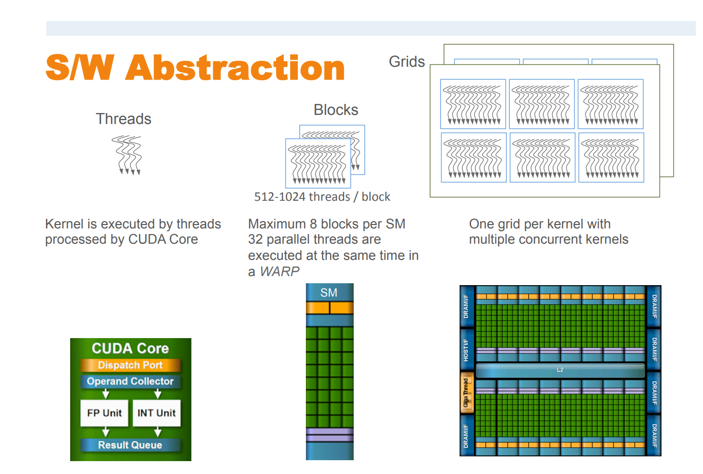
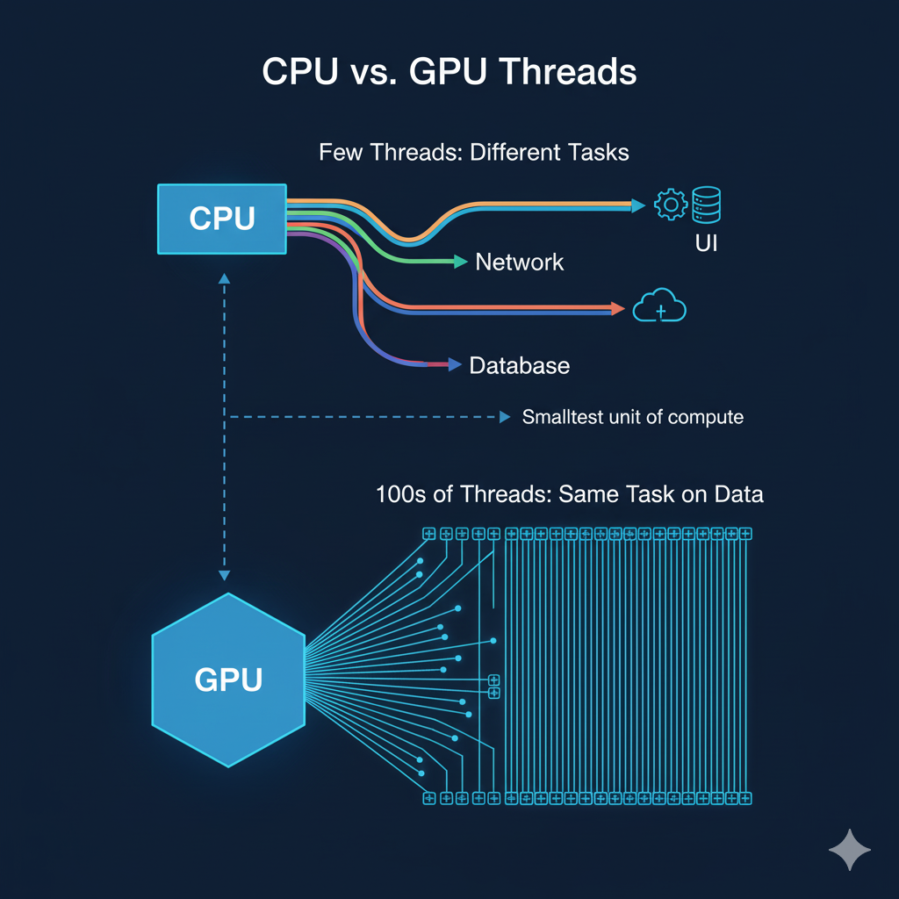
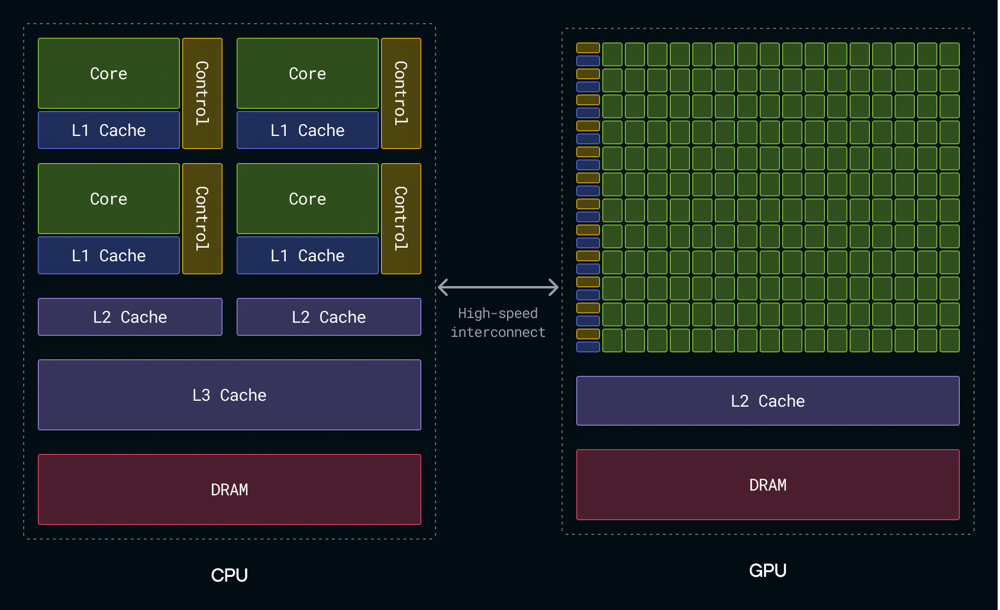
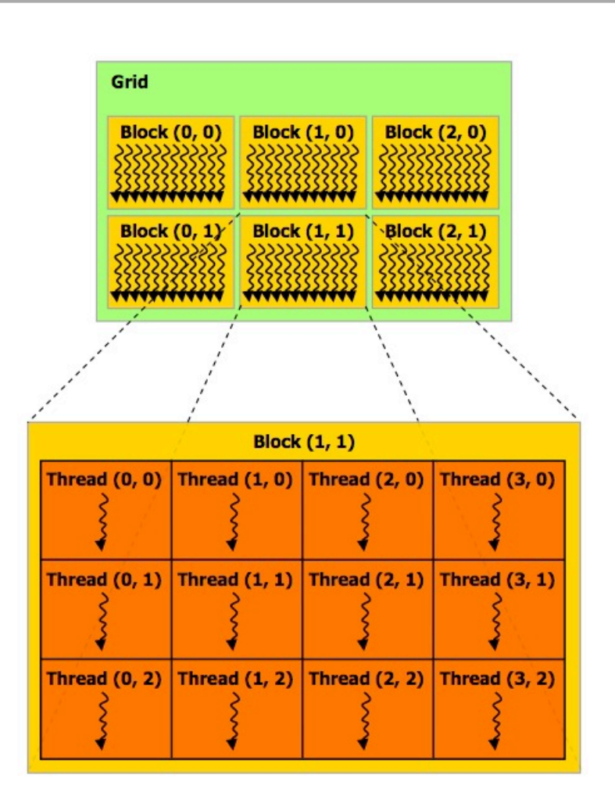
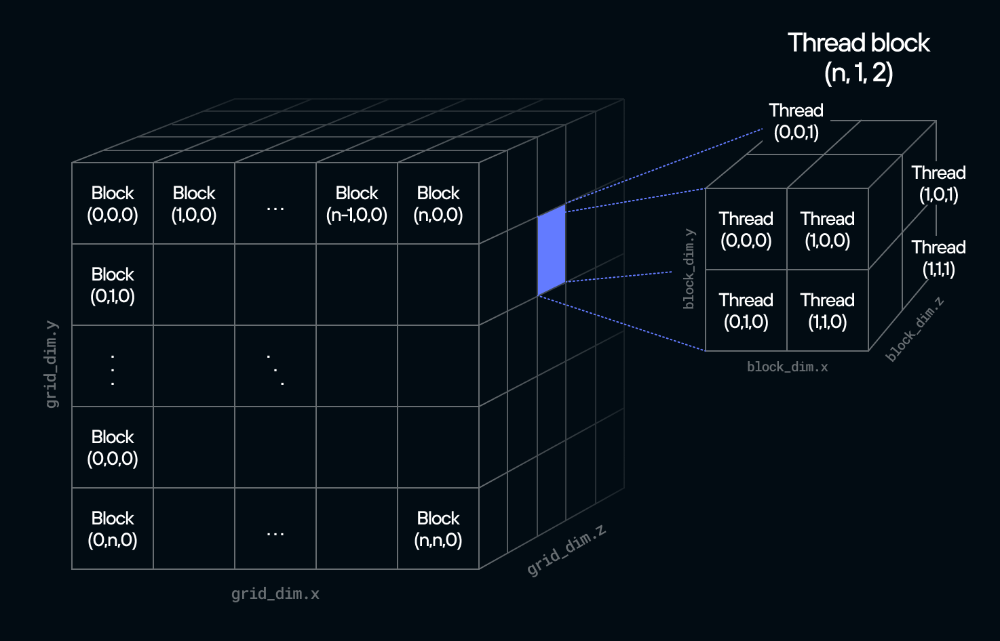

# 🔥 What is Mojo?

**Mojo** is a systems programming language built for **high-performance AI** on any hardware! 🚀

---

## 🎯 The Big Idea

- 🐍 **Pythonic syntax** - Easy to learn if you know Python
- 🤝 **Full Python integration** - Use all your favorite Python libraries
- 🌐 **One language, all hardware** - CPUs, GPUs, ASICs... no CUDA needed!
- ⚡ **Built on MLIR** - Modern compiler for heterogeneous hardware

**Mojo = Python's simplicity + C's performance** 🔥🚀

---

## 😰 Why do need another language?

 - Step 1: Research & Training (Python) 🐍
 - Step 2: Optimize for Production 😓    (Use TensorRT, ONNX Runtime, etc.. Rewrite critical parts in C++/CUDA , Maintain TWO codebases now!)
 - Step 3: Deployment Headaches 🤯  • CUDA = NVIDIA only,  Want AMD/Apple? Rewrite AGAIN!  • Update model? Sync both codebases!


---


## 🚀 Why Mojo for GPU Programming?

### 🌐 Vendor Independent GPU Programmability

🎯 **Write Once, Deploy Anywhere**
- ✅ NVIDIA GPUs 
- ✅ AMD GPUs 
- ✅ Apple Silicon
- ✅ Future hardware 
- ✅ No CUDA required
- ✅ No vendor lock-in
- ✅ Pythonic syntax
- ✅ CPU + GPU in the same code

---

## GPU Fundamentals



## 🎮 What is a GPU Kernel?
A **GPU kernel** is a function that runs on a GPU, executing a specific computation on a large dataset **in parallel** across **thousands or millions of threads**! 🚀

---

## 🆚 How is GPU different?



---

## Host, Device - Workflow

####  Host =  CPU
####  Device = GPU





### Step-by-Step Process

```
Host (CPU) 💻  ←────────→  Device (GPU) 🎮
     ↓                           ↓
Launches Kernel 🚀          Executes Kernel 🔥
                                 ↓
                            Grid of Blocks 🗺️
                                 ↓
                            Blocks 🧱🧱🧱
                                 ↓
                            Threads 🧵🧵🧵
                                 ↓
                         Parallel Computation ⚡

Let's go! 🔥🔥🔥  Time for some code

```mojo
from sys import has_amd_gpu_accelerator, has_nvidia_gpu_accelerator
from gpu import thread_idx, block_idx
from gpu.host import DeviceContext
```

```mojo
def main():
    @parameter
    if  has_nvidia_gpu_accelerator():
        print("NVIDIA GPU detected")
        # Enable GPU processing
    elif has_amd_gpu_accelerator():
          print("AMD GPU detected")
    else:
        print("No GPU detected")
        # Print error or fall back to CPU-only execution
```

```text
NVIDIA GPU detected
```

### Our First Program (kernel)

Writing a simple kernel....

```mojo

fn print_threads():
    print(
    "block: [",
    block_idx.x,
    "]",
    "thread: [",
    thread_idx.x,
    "]"
    )

# Obtain a reference to the accelerator (GPU) context.
var ctx = DeviceContext()

# enqueue_function = Host is scheduling the operation to execute asynchronously
ctx.enqueue_function[print_threads](grid_dim=4, block_dim=4)  # BLOCKS_PER_GRID = 4, THREADS_PER_BLOCK = 4

# Wait for all the threads to finish. 
ctx.synchronize()
```

```text
block: [ 1 ] thread: [ 0 ]
block: [ 1 ] thread: [ 1 ]
block: [ 1 ] thread: [ 2 ]
block: [ 1 ] thread: [ 3 ]
block: [ 2 ] thread: [ 0 ]
block: [ 2 ] thread: [ 1 ]
block: [ 2 ] thread: [ 2 ]
block: [ 2 ] thread: [ 3 ]
block: [ 3 ] thread: [ 0 ]
block: [ 3 ] thread: [ 1 ]
block: [ 3 ] thread: [ 2 ]
block: [ 3 ] thread: [ 3 ]
block: [ 0 ] thread: [ 0 ]
block: [ 0 ] thread: [ 1 ]
block: [ 0 ] thread: [ 2 ]
block: [ 0 ] thread: [ 3 ]
```

You can visualize like this in matrix form

```rust
Thread  |    0  1  2  3
-------------------------
block 0 | [  0  1  2  3 ]
block 1 | [  0  1  2  3 ]
block 2 | [  0  1  2  3 ]
block 3 | [  0  1  2  3 ]
```






# 📌 Key Takeaways

- ✨ Mojo = Python + Performance
- 🎯 One language for the entire stack
- 🌐 Portable across all hardware
- 🤖 Perfect for AI workloads
-  🔥 **Kernel** A function that runs on the GPU across many threads simultaneously
- 🧵 **Threads** Individual execution units on the GPU (thousands to millions per kernel)
- 🧱 **Blocks** Groups of threads (32-1024) that can cooperate and share memory
- 🗺️ **Grid** Collection of all blocks launched by a kernel