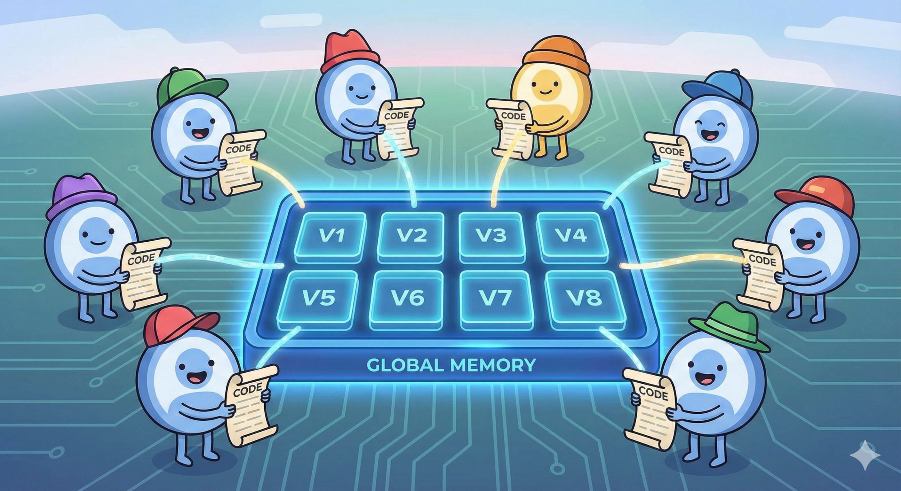

# 🔥 GPU Shared Memory - Benefits and Usecases

## 📚 What You'll Learn

In this tutorial, you'll master:
- 🚀 **Shared Memory** - Fast, block-local storage for GPU threads
- 🔄 **Thread Synchronization** - Coordinating threads with barriers
- 📦 **Memory Management** - Understanding block-local vs global data
- ⚡ **Performance Optimization** - When shared memory actually helps

---

## 🎯 The Key Insight

**Shared memory provides fast, block-local storage that all threads in a block can access, but requires careful coordination between threads.**


### Fundamental Question :  Is the copy worth it?   
- Does COPY + EXECUTE (in local) > EXECUTE (global)

---

```python
## 🔥 Real-World Examples Where Shared Memory Helps

### Example 1: Multiple Accesses per Thread

# ❌ BAD: Read from global memory 4 times per thread
sum = a[i] + a[i+1] + a[i+2] + a[i+3]  
# 4 slow global reads

# ✅ GOOD: Copy to shared once, then read 4 times locally
shared[local_i] = a[global_i]  # 1 slow global read
sum = shared[i] + shared[i+1] + shared[i+2] + shared[i+3]   # 4 fast shared memory reads!

# 1 slow global read + # 4 fast shared memory reads > 4 slow global reads???
```

## 📊 Our program memory layout


---

```mojo
from memory import UnsafePointer
from gpu import thread_idx, block_idx, block_dim, barrier
from gpu.host import DeviceContext
from gpu.memory import AddressSpace
from layout import Layout, LayoutTensor
from testing import assert_equal

alias TPB = 4
alias SIZE = 8
alias BLOCKS_PER_GRID = (2, 1)
alias THREADS_PER_BLOCK = (TPB, 1)
alias dtype = DType.float32
alias layout = Layout.row_major(SIZE)
```

```mojo
# ANCHOR: add_10_shared_layout_tensor_solution
fn add_10_shared_layout_tensor[
    layout: Layout
](
    output: LayoutTensor[dtype, layout, MutAnyOrigin],
    a: LayoutTensor[dtype, layout, ImmutAnyOrigin],
    size: UInt,
):
    # Allocate shared memory using tensor builder
    shared = LayoutTensor[
        dtype,
        Layout.row_major(TPB),
        MutAnyOrigin,
        address_space = AddressSpace.SHARED,
    ].stack_allocation()

    global_i = block_dim.x * block_idx.x + thread_idx.x
    local_i = thread_idx.x

    if global_i < size:  # Boundary condition

        #Block 0, Thread 2: shared[2] = a[2] <-- this location is in Block #0 (called shared[2])
        #Block 1, Thread 2: shared[2] = a[6] <-- this location is in Block #1 (called shared[2])
        # 2 mutually exclusive location. 
        shared[local_i] = a[global_i]
        
    #Thread Mgmt.  
    #This ensures memory operations before the barrier are visible to all threads after the barrier.
    barrier()

    if global_i < size:  # Boundary condition
        output[global_i] = shared[local_i] + 10


```



```mojo
  # Initialize GPU context
with DeviceContext() as ctx:

      # Create a buffer in device (GPU) memory
    out = ctx.enqueue_create_buffer[dtype](SIZE)
    out.enqueue_fill(0)

      # Create a buffer in device (GPU) memory and init value 1
    a = ctx.enqueue_create_buffer[dtype](SIZE)
    a.enqueue_fill(1)

    out_tensor = LayoutTensor[dtype, layout, MutAnyOrigin](out)
    a_tensor = LayoutTensor[dtype, layout, ImmutAnyOrigin](a)

    alias kernel = add_10_shared_layout_tensor[layout]

     # Launch the GPU kernel with the following arguments:
    ctx.enqueue_function_checked[kernel, kernel](
        out_tensor,
        a_tensor,
        UInt(SIZE),
        grid_dim=BLOCKS_PER_GRID,
        block_dim=THREADS_PER_BLOCK,
    )

   # Wait for all GPU operations to complete.
    ctx.synchronize()

with out.map_to_host() as out_host:
        print("out:", out_host)

```

```text
out: HostBuffer([11.0, 11.0, 11.0, 11.0, 11.0, 11.0, 11.0, 11.0])
```

### ✅ DO Use Shared Memory When:

1. **Data Reuse** - Same data accessed multiple times
2. **Neighbor Access** - Threads need nearby data
3. **Reduction Operations** - Combining results across threads
4. **Tiled Algorithms** - Matrix multiplication, convolution
5. **Iterative Refinement** - Multiple passes over data

### ❌ DON'T Use Shared Memory When:

1. **Single Access** - Each element read only once
2. **No Thread Cooperation** - Independent computations
3. **Simple Operations** - Overhead exceeds benefit
4. **Sequential Access** - Global memory cache handles it

## 🎓 Key Takeaways

- 🧠 **Shared memory is 20-30x faster** than global memory
- 🔄 **Always use `barrier()`** after writing to shared memory
- 🎯 **Shared memory helps with data reuse**, not single accesses
---

## 🚀 Next Steps

Now that you understand shared memory, you can:

1. Implement tiled matrix multiplication
2. Build efficient convolution kernels
3. Optimize reduction operations
4. Create high-performance image processing pipelines