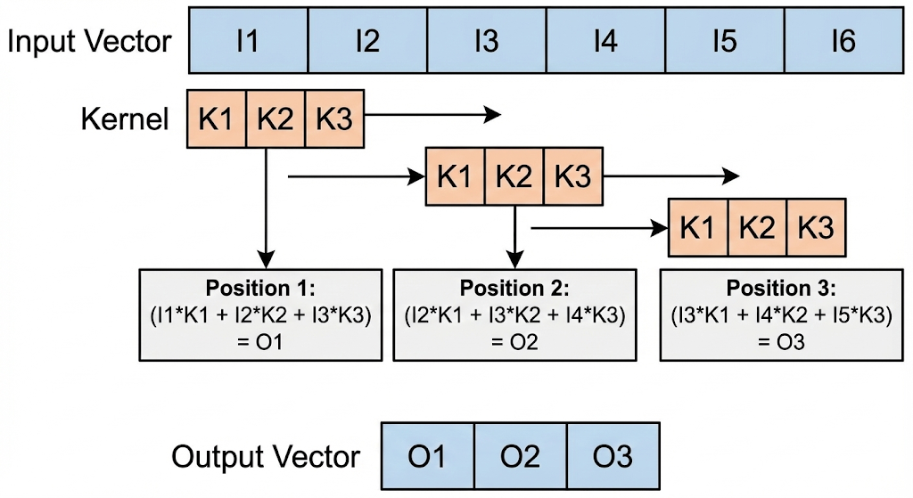
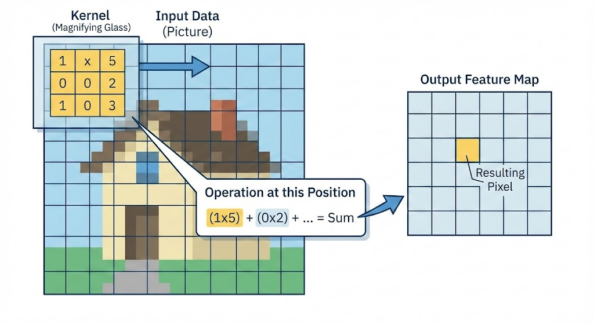

# 🎯 Convolution Explained!

## 🌊 What is Convolution?

Imagine you're sliding a magnifying glass 🔍 over a picture 🖼️. At each position, you're looking at a small patch of the image through your magnifying glass. Convolution is exactly like that!

**The Magic Recipe** 🪄:
1. Take a small filter (called a **kernel**) - think of it as your magnifying glass
2. Slide it across your input data (like scanning a photo) 👈👉
3. At each position, multiply the filter values with what's underneath ✖️
4. Sum up all those products ➕
5. That sum becomes ONE pixel in your output! ✨






**Why do we care?** 🤔
- 📸 **Image Processing**: Blur, sharpen, detect edges
- 🧠 **Neural Networks**: Extract features automatically
- 🎵 **Audio**: Apply filters and effects
- 📊 **Signal Processing**: Smooth data, find patterns

---

## 💻 Today's Kernel Specs Breakdown

Now let's decode YOUR specific setup:

```
alias TPB = 8                           // 🧵 8 threads per block
alias SIZE_2 = 15                       // 📏 15x15 input/output grid
alias CONV_2 = 4                        // 🔲 4x4 convolution kernel
alias BLOCKS_PER_GRID_2 = (2, 1)       // 🏗️ 2 blocks in x-direction
alias THREADS_PER_BLOCK_2 = (TPB, 1)   // 🧵 8 threads per block (in x)
```

**What's happening here?** 🎬

🎯 **Your Canvas**: 15×15 grid (225 elements total)

🔲 **Your Filter**: 4×4 kernel (16 weights sliding around)

⚡ **GPU Parallelization**:
- You're using **2 blocks** × **8 threads** = **16 parallel workers** 🏃‍♂️🏃‍♀️
- Each thread handles a portion of the convolution
- `row_major` layout means data is stored row-by-row (like reading a book 📖)
- `float32` gives you 32-bit precision for smooth calculations

**The Cool Part** 🚀:
Instead of sliding your 4×4 kernel one position at a time sequentially (slow 🐌), you're processing multiple positions **simultaneously** using GPU parallelism (fast 🚄)!

This setup is perfect for real-time image filters, AI feature extraction, or demonstrating parallel computing concepts! 🎓✨

</div>

```mojo
from gpu import thread_idx, block_idx, block_dim, barrier
from gpu.host import DeviceContext
from gpu.memory import AddressSpace
from layout import Layout, LayoutTensor
from sys import size_of, argv
from testing import assert_equal


alias TPB = 8
alias SIZE = 15
alias CONV = 4
alias BLOCKS_PER_GRID = (2, 1)
alias THREADS_PER_BLOCK = (TPB, 1)
alias in_layout = Layout.row_major(SIZE)
alias out_layout = Layout.row_major(SIZE)
alias conv_layout = Layout.row_major(CONV)
alias dtype = DType.float32
```

```mojo
fn conv_1d_block_boundary[
    in_layout: Layout, out_layout: Layout, conv_layout: Layout, dtype: DType
](
    output: LayoutTensor[dtype, out_layout, MutAnyOrigin],
    a: LayoutTensor[dtype, in_layout, ImmutAnyOrigin],
    b: LayoutTensor[dtype, conv_layout, ImmutAnyOrigin],
):

   #Get global and local index
    global_i = Int(block_dim.x * block_idx.x + thread_idx.x)
    local_i = Int(thread_idx.x)

    # CREATE SHARED Memory. But wait! first need to account for padding
    # End up created 3 extra spaces in both blocks
    shared_a = LayoutTensor[
        dtype,
        Layout.row_major(TPB + CONV - 1),   ##Reserve extra
        MutAnyOrigin,
        address_space = AddressSpace.SHARED,
    ].stack_allocation()

   #Ths is for convolution vector
    shared_b = LayoutTensor[
        dtype,
        Layout.row_major(CONV),
        MutAnyOrigin,
        address_space = AddressSpace.SHARED,
    ].stack_allocation()

    #COPY operation
    if global_i < SIZE:
        shared_a[local_i] = a[global_i]
    else:
        shared_a[local_i] = 0

    #For the padded location in the 1st block load elements needed for convolution
    if local_i < CONV - 1:     ## here both block (0,1,2) local indice 
        next_idx = global_i + TPB  # For the first block will get indices, 8,9,10, second one will init  = 16,17,18
        if next_idx < SIZE:   #w within the size of the data. 16,17,18 will not satisfy
            shared_a[TPB + local_i] = a[next_idx]  # copy 8,19,10 => 8th 9th 10th of the first block
        else:
            shared_a[TPB + local_i] = 0   # else init 0.00 (useful for second block)    

    #This for convo shared space. 
    if local_i < CONV:
        shared_b[local_i] = b[local_i]

    #Sync the threads
    barrier()

    if global_i < SIZE:   #boundary condition
        var local_sum: output.element_type = 0

        @parameter   # Simple dot product between 2 vectors
        for j in range(CONV):  # J =  (0,1,2,3) 
            if global_i + j < SIZE:  #boundary condition. for the second block.. if its beyond its size. no point in multiplying. Best practice!  
                local_sum += shared_a[local_i + j] * shared_b[j]

        output[global_i] = local_sum

```

```mojo

with DeviceContext() as ctx:
    size = SIZE
    conv = CONV
    out = ctx.enqueue_create_buffer[dtype](SIZE)
    out.enqueue_fill(0)
    a = ctx.enqueue_create_buffer[dtype](SIZE)
    a.enqueue_fill(0)
    b = ctx.enqueue_create_buffer[dtype](CONV)
    b.enqueue_fill(0)
    with a.map_to_host() as a_host:
        for i in range(SIZE):
            a_host[i] = i

    with b.map_to_host() as b_host:
        for i in range(CONV):
            b_host[i] = i

    var out_tensor = LayoutTensor[dtype, out_layout, MutAnyOrigin](
            out
        )
    var a_tensor = LayoutTensor[dtype, in_layout, ImmutAnyOrigin](a)
    var b_tensor = LayoutTensor[dtype, conv_layout, ImmutAnyOrigin](b)
    alias kernel = conv_1d_block_boundary[
            in_layout, out_layout, conv_layout, dtype
        ]
    ctx.enqueue_function_checked[kernel, kernel](
            out_tensor,
            a_tensor,
            b_tensor,
            grid_dim=BLOCKS_PER_GRID,
            block_dim=THREADS_PER_BLOCK,
        )

    ctx.synchronize()

    with out.map_to_host() as out_host:
        print("out:", out_host)

```

```text
out: HostBuffer([14.0, 20.0, 26.0, 32.0, 38.0, 44.0, 50.0, 56.0, 62.0, 68.0, 74.0, 80.0, 41.0, 14.0, 0.0])
```

## 🎯 Key Takeaways
 - 1️⃣ The Overlap Problem & Smart Memory Sharing 🔄
 - 2️⃣ Boundary Handling