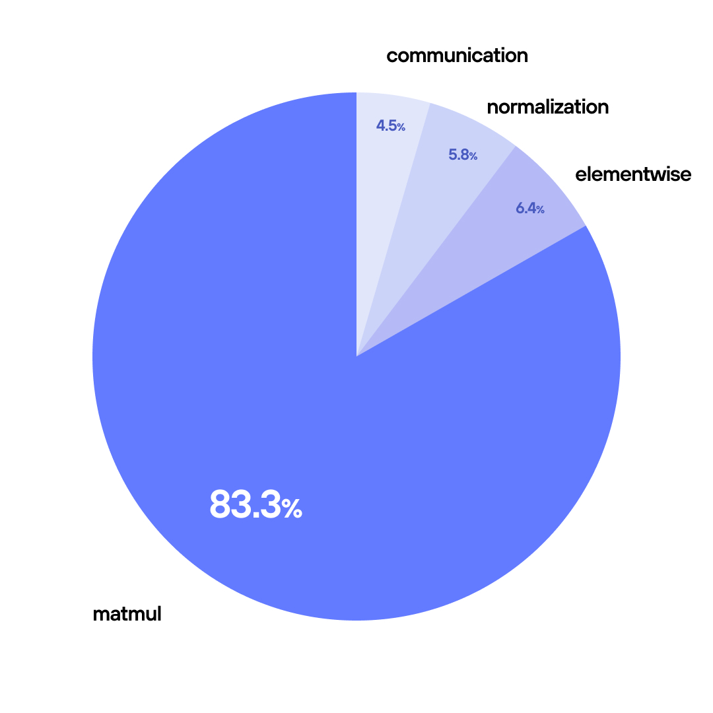

# 🚀 Why do we care about Matrix Multiplications? 💎

Every "thought" an AI has 💭—from generating words in an LLM 🗣️ to rendering pixels in a diffusion model 🎨—is essentially just a massive series of **Matrix Multiplications ()**.

It is the fundamental heartbeat 💓 of Artificial Intelligence. 🤖

We are going to unlock the intermediate hardware "tricks" 🎩✨ that separate standard code from **world-class AI kernels.** 🏆




```mojo
from gpu import thread_idx, block_idx, block_dim, barrier
from gpu.host import DeviceContext
from gpu.memory import AddressSpace
from layout import Layout, LayoutTensor
from sys import size_of, argv
from testing import assert_equal

comptime dtype = DType.float32
comptime layout = Layout.row_major(SIZE, SIZE)
comptime TPB = 3
comptime SIZE = 9
comptime BLOCKS_PER_GRID = (3, 3)
comptime THREADS_PER_BLOCK = (TPB, TPB)
comptime NUM_THREADS = TPB * TPB
comptime BLOCK_DIM_COUNT = 2
```

```mojo
fn naive_matmul[
    layout: Layout, SIZE: UInt
](
    output: LayoutTensor[dtype, layout, MutAnyOrigin],
    a: LayoutTensor[dtype, layout, ImmutAnyOrigin],
    b: LayoutTensor[dtype, layout, ImmutAnyOrigin],
):
    row = block_dim.y * block_idx.y + thread_idx.y
    col = block_dim.x * block_idx.x + thread_idx.x

    if row < SIZE and col < SIZE:
        var acc: output.element_type = 0

        @parameter
        for k in range(SIZE):
            acc += a[row, k] * b[k, col]

        output[row, col] = acc
```

**Generated assembly**: Loop with branch instructions, counter checks, etc. 🐌

### With `@parameter` (Compile-time Unrolled):

@parameter
for k in range(4):  # Compile-time unrolled
    acc += a_shared[local_row, k] * b_shared[k, local_col]

**Generated assembly**: 
```
acc += a_shared[local_row, 0] * b_shared[0, local_col]
acc += a_shared[local_row, 1] * b_shared[1, local_col]  
acc += a_shared[local_row, 2] * b_shared[2, local_col]
acc += a_shared[local_row, 3] * b_shared[3, local_col]
```

## ⚡ Why This Matters for Performance

### 🎯 **Eliminates Loop Overhead**
- ❌ No branch instructions
- ❌ No counter increments  
- ❌ No condition checks
- ✅ Just pure computation!

This becomes a series of multiply-accumulate operations with **zero loop overhead** - exactly what you want for performance-critical GPU kernels! 🔥💪

**Key**: Only works when the loop bounds are known at compile time! 🎯

---

# 🧩 GPU Memory Tiling for Matrix Multiplication 🚀
## 🎯 What's Happening Here?
This diagram shows **memory tiling** - a clever GPU programming technique for handling large matrix multiplications! 💪


## 📊 The Setup

We have three matrices in a classic **C = A × B** multiplication:
- 🟦 **Matrix A**: `M × K` dimensions
- 🟩 **Matrix B**: `K × N` dimensions  
- 🟨 **Matrix C**: `M × N` dimensions (result)

## 🧩 The Tiling Strategy

### 🔥 Why Tile?
Instead of loading massive matrices entirely into GPU memory (which might not fit! 😱), we break them into smaller **chunks** or **tiles** 📦

## 🧠 Key Insight
The magic is in the **K-axis advancement** - by systematically moving through the shared dimension, each tile gets all the data it needs to compute its final result piece by piece! 🎯✨

```mojo

fn matmul_tiled[
    layout: Layout, SIZE: UInt
](
    output: LayoutTensor[dtype, layout, MutAnyOrigin],
    a: LayoutTensor[dtype, layout, ImmutAnyOrigin],
    b: LayoutTensor[dtype, layout, ImmutAnyOrigin],
):
    local_row = thread_idx.y
    local_col = thread_idx.x
    tiled_row = block_idx.y * TPB + local_row
    tiled_col = block_idx.x * TPB + local_col

    a_shared = LayoutTensor[
        dtype,
        Layout.row_major(TPB, TPB),
        MutAnyOrigin,
        address_space = AddressSpace.SHARED,
    ].stack_allocation()
    b_shared = LayoutTensor[
        dtype,
        Layout.row_major(TPB, TPB),
        MutAnyOrigin,
        address_space = AddressSpace.SHARED,
    ].stack_allocation()

    var acc: output.element_type = 0

    # Iterate over tiles to compute matrix product
    @parameter
    for tile in range((SIZE + TPB - 1) // TPB):
        # Load A tile - global row stays the same, col determined by tile

        var tile_start = tile * TPB # from where do i jump?
 
        if tiled_row < SIZE and (tile_start + local_col) < SIZE:
            a_shared[local_row, local_col] = a[
                tiled_row, tile_start + local_col
            ]

        # Load B tile - row determined by tile, global col stays the same
        if (tile_start + local_row) < SIZE and tiled_col < SIZE:
            b_shared[local_row, local_col] = b[
                tile_start + local_row, tiled_col
            ]

        barrier()

        # Matrix multiplication within the tile
        if tiled_row < SIZE and tiled_col < SIZE:

            @parameter
            for k in range(min(TPB, SIZE - tile * TPB)):
                acc += a_shared[local_row, k] * b_shared[k, local_col]

        barrier()

    # Write out final result
    if tiled_row < SIZE and tiled_col < SIZE:
        output[tiled_row, tiled_col] = acc
```

```mojo
from gpu.memory import async_copy_wait_all
from layout.layout_tensor import copy_dram_to_sram_async

fn matmul_idiomatic_tiled[
    layout: Layout, SIZE: UInt
](
    output: LayoutTensor[dtype, layout, MutAnyOrigin],
    a: LayoutTensor[dtype, layout, ImmutAnyOrigin],
    b: LayoutTensor[dtype, layout, ImmutAnyOrigin],
):
    local_row = thread_idx.y
    local_col = thread_idx.x
    tiled_row = block_idx.y * TPB + local_row
    tiled_col = block_idx.x * TPB + local_col

    out_tile = output.tile[TPB, TPB](Int(block_idx.y), Int(block_idx.x))
    a_shared = LayoutTensor[
        dtype,
        Layout.row_major(TPB, TPB),
        MutAnyOrigin,
        address_space = AddressSpace.SHARED,
    ].stack_allocation()
    b_shared = LayoutTensor[
        dtype,
        Layout.row_major(TPB, TPB),
        MutAnyOrigin,
        address_space = AddressSpace.SHARED,
    ].stack_allocation()

    var acc: output.element_type = 0

    comptime load_a_layout = Layout.row_major(1, TPB)  # Coalesced loading
    comptime load_b_layout = Layout.row_major(1, TPB)  # Coalesced loading
    # Note: Both matrices stored in same orientation for correct matrix multiplication
    # Transposed loading would be useful if B were pre-transposed in global memory

    @parameter
    for idx in range(SIZE // TPB):  # Perfect division: 9 // 3 = 3 tiles
        # Get tiles from A and B matrices
        a_tile = a.tile[TPB, TPB](Int(block_idx.y), Int(idx))
        b_tile = b.tile[TPB, TPB](Int(idx), Int(block_idx.x))

        # Asynchronously copy tiles to shared memory with consistent orientation
        copy_dram_to_sram_async[
            thread_layout=load_a_layout,
            num_threads=NUM_THREADS,
            block_dim_count=BLOCK_DIM_COUNT,
        ](a_shared, a_tile)
        copy_dram_to_sram_async[
            thread_layout=load_b_layout,
            num_threads=NUM_THREADS,
            block_dim_count=BLOCK_DIM_COUNT,
        ](b_shared, b_tile)

        # Wait for all async copies to complete
        async_copy_wait_all()
        barrier()

        # Compute partial matrix multiplication for this tile
        @parameter
        for k in range(TPB):
            acc += a_shared[local_row, k] * b_shared[k, local_col]

        barrier()

    # Write final result to output tile
    if tiled_row < SIZE and tiled_col < SIZE:
        out_tile[local_row, local_col] = acc

```

---

### 🚀 The "Secret Sauce" of Mojo GPU Optimization

#### 1. The Express Lane: Bypassing Registers

* **Function:** `copy_dram_to_sram_async`
* **What it means:** Standard loading stops at the thread's private Registers first. This function uses dedicated hardware on the GPU to skip that step, saving register space for actual math.

- > **Standard Path (Slow):**
> Global RAM ➡️ [Registers] ➡️ Shared RAM
- > **Mojo Async Path (Fast):**
> Global RAM ➡️➡️➡️ Shared RAM **(Bypass!)**

#### 2. Pipelining: Hiding the Wait

* **What it means:** Normal execution waits for data before computing ("stop-and-go"). Asynchronous loading fetches the *next* chunk of data while the GPU is busy calculating the *current* chunk.

- > **Standard (Synchronous):**
> `[Fetch T1]` → (Wait) → `[Compute T1]` → `[Fetch T2]` → (Wait) → `[Compute T2]`
- > **Mojo (Asynchronous Pipeline):**
> `[Fetch T1]` → `[Compute T1]` → `[Compute T2]` → ...
> .............. ⤵️ `[Fetch T2]` .... ⤵️ `[Fetch T3]` ... **(Overlap!)**

#### 3. Coalesced Layout: The "Bulk Buy"

* **Code:** `Layout.row_major(1, TPB)`
* **What it means:** This standard layout ensures neighboring threads grab neighboring memory addresses. It’s the difference between buying 32 items in one giant shopping cart transaction versus 32 separate trips through the checkout line.

#### 4. Zero-Overhead Setup

* **What it means:** Because the dedicated hardware engine handles the transfer directly to Shared Memory, you don't need to write manual loops to initialize or zero-out the memory first.

> ❌ `for i in range(TPB): sram[i] = 0` (Manual setup removed)
> ✅ Hardware handles destination state automatically.

---

```mojo
ctx = DeviceContext()

out = ctx.enqueue_create_buffer[dtype](SIZE * SIZE)
out.enqueue_fill(0)

out_2 = ctx.enqueue_create_buffer[dtype](SIZE * SIZE)
out_2.enqueue_fill(0)

out_3 = ctx.enqueue_create_buffer[dtype](SIZE * SIZE)
out_3.enqueue_fill(0)

inp1 = ctx.enqueue_create_buffer[dtype](SIZE * SIZE)
inp1.enqueue_fill(0)

inp2 = ctx.enqueue_create_buffer[dtype](SIZE * SIZE)
inp2.enqueue_fill(0)

expected = ctx.enqueue_create_host_buffer[dtype](SIZE * SIZE)
expected.enqueue_fill(0)
```

```mojo

with inp1.map_to_host() as inp1_host, inp2.map_to_host() as inp2_host:
    for row in range(SIZE):
        for col in range(SIZE):
            val = row * SIZE + col
            # row major: placing elements row by row
            inp1_host[row * SIZE + col] = val
            inp2_host[row * SIZE + col] = Float32(2.0) * val

    # inp1 @ inp2
    for i in range(SIZE):
        for j in range(SIZE):
            for k in range(SIZE):
                expected[i * SIZE + j] += (
                    inp1_host[i * SIZE + k] * inp2_host[k * SIZE + j]
                )

out_tensor = LayoutTensor[dtype, layout, MutAnyOrigin](out)
out_tensor_2 = LayoutTensor[dtype, layout, MutAnyOrigin](out_2)
out_tensor_3 = LayoutTensor[dtype, layout, MutAnyOrigin](out_3)
a_tensor = LayoutTensor[dtype, layout, ImmutAnyOrigin](inp1)
b_tensor = LayoutTensor[dtype, layout, ImmutAnyOrigin](inp2)

# Naive MatMul
comptime kernel_naive_matmul = naive_matmul[layout, UInt(SIZE)]

ctx.enqueue_function_checked[kernel_naive_matmul, kernel_naive_matmul](
        out_tensor,
        a_tensor,
        b_tensor,
        grid_dim=BLOCKS_PER_GRID,
        block_dim=THREADS_PER_BLOCK,
    )

#####################################################################################################

```

```mojo
# Tiled
out_tensor_tiled = LayoutTensor[dtype, layout, MutAnyOrigin](
        out_2
    )
a_tensor_tiled = LayoutTensor[dtype, layout, ImmutAnyOrigin](
        inp1
    )
b_tensor_tiled = LayoutTensor[dtype, layout, ImmutAnyOrigin](
        inp2
    )
comptime kernel_matmul_tiled = matmul_tiled[layout, UInt(SIZE)]
ctx.enqueue_function_checked[kernel_matmul_tiled, kernel_matmul_tiled](
        out_tensor_tiled,
        a_tensor_tiled,
        b_tensor_tiled,
        grid_dim=BLOCKS_PER_GRID,
        block_dim=THREADS_PER_BLOCK,
    )

```

```mojo

# idiomatic-tiled
out_tensor_idiomatic_tiled = LayoutTensor[dtype, layout, MutAnyOrigin](
        out_3
    )
a_tensor_tiled = LayoutTensor[dtype, layout, ImmutAnyOrigin](
        inp1
    )
b_tensor_tiled = LayoutTensor[dtype, layout, ImmutAnyOrigin](
        inp2
    )

comptime kernel_matmul_idiomatic_tiled = matmul_idiomatic_tiled[
        layout, UInt(SIZE)
    ]
ctx.enqueue_function_checked[kernel_matmul_idiomatic_tiled, kernel_matmul_idiomatic_tiled](
        out_tensor_idiomatic_tiled,
        a_tensor_tiled,
        b_tensor_tiled,
        grid_dim=BLOCKS_PER_GRID,
        block_dim=THREADS_PER_BLOCK,
    )
```

```mojo
ctx.synchronize()

with out.map_to_host() as out_host:
    print("out:", out_host)
    print("expected:", expected)
    for col in range(SIZE):
        for row in range(SIZE):
            assert_equal(
                out_host[col * SIZE + row], expected[col * SIZE + row]
            )
```

```text
out: HostBuffer([3672.0, 3744.0, 3816.0, 3888.0, 3960.0, 4032.0, 4104.0, 4176.0, 4248.0, 9504.0, 9738.0, 9972.0, 10206.0, 10440.0, 10674.0, 10908.0, 11142.0, 11376.0, 15336.0, 15732.0, 16128.0, 16524.0, 16920.0, 17316.0, 17712.0, 18108.0, 18504.0, 21168.0, 21726.0, 22284.0, 22842.0, 23400.0, 23958.0, 24516.0, 25074.0, 25632.0, 27000.0, 27720.0, 28440.0, 29160.0, 29880.0, 30600.0, 31320.0, 32040.0, 32760.0, 32832.0, 33714.0, 34596.0, 35478.0, 36360.0, 37242.0, 38124.0, 39006.0, 39888.0, 38664.0, 39708.0, 40752.0, 41796.0, 42840.0, 43884.0, 44928.0, 45972.0, 47016.0, 44496.0, 45702.0, 46908.0, 48114.0, 49320.0, 50526.0, 51732.0, 52938.0, 54144.0, 50328.0, 51696.0, 53064.0, 54432.0, 55800.0, 57168.0, 58536.0, 59904.0, 61272.0])
expected: HostBuffer([3672.0, 3744.0, 3816.0, 3888.0, 3960.0, 4032.0, 4104.0, 4176.0, 4248.0, 9504.0, 9738.0, 9972.0, 10206.0, 10440.0, 10674.0, 10908.0, 11142.0, 11376.0, 15336.0, 15732.0, 16128.0, 16524.0, 16920.0, 17316.0, 17712.0, 18108.0, 18504.0, 21168.0, 21726.0, 22284.0, 22842.0, 23400.0, 23958.0, 24516.0, 25074.0, 25632.0, 27000.0, 27720.0, 28440.0, 29160.0, 29880.0, 30600.0, 31320.0, 32040.0, 32760.0, 32832.0, 33714.0, 34596.0, 35478.0, 36360.0, 37242.0, 38124.0, 39006.0, 39888.0, 38664.0, 39708.0, 40752.0, 41796.0, 42840.0, 43884.0, 44928.0, 45972.0, 47016.0, 44496.0, 45702.0, 46908.0, 48114.0, 49320.0, 50526.0, 51732.0, 52938.0, 54144.0, 50328.0, 51696.0, 53064.0, 54432.0, 55800.0, 57168.0, 58536.0, 59904.0, 61272.0])
```

```mojo
with out_2.map_to_host() as out_2_host:
    print("out_2_host:", out_2_host)
    for col in range(SIZE):
        for row in range(SIZE):
                out_2_host[col * SIZE + row]
            
```

```text
out_2_host: HostBuffer([3672.0, 3744.0, 3816.0, 3888.0, 3960.0, 4032.0, 4104.0, 4176.0, 4248.0, 9504.0, 9738.0, 9972.0, 10206.0, 10440.0, 10674.0, 10908.0, 11142.0, 11376.0, 15336.0, 15732.0, 16128.0, 16524.0, 16920.0, 17316.0, 17712.0, 18108.0, 18504.0, 21168.0, 21726.0, 22284.0, 22842.0, 23400.0, 23958.0, 24516.0, 25074.0, 25632.0, 27000.0, 27720.0, 28440.0, 29160.0, 29880.0, 30600.0, 31320.0, 32040.0, 32760.0, 32832.0, 33714.0, 34596.0, 35478.0, 36360.0, 37242.0, 38124.0, 39006.0, 39888.0, 38664.0, 39708.0, 40752.0, 41796.0, 42840.0, 43884.0, 44928.0, 45972.0, 47016.0, 44496.0, 45702.0, 46908.0, 48114.0, 49320.0, 50526.0, 51732.0, 52938.0, 54144.0, 50328.0, 51696.0, 53064.0, 54432.0, 55800.0, 57168.0, 58536.0, 59904.0, 61272.0])
```

```mojo
with out_3.map_to_host() as out_3_host:
    print("out_3_host:", out_3_host)
    for col in range(SIZE):
        for row in range(SIZE):
                out_3_host[col * SIZE + row]
            
```

```text
out_3_host: HostBuffer([3672.0, 3744.0, 3816.0, 3888.0, 3960.0, 4032.0, 4104.0, 4176.0, 4248.0, 9504.0, 9738.0, 9972.0, 10206.0, 10440.0, 10674.0, 10908.0, 11142.0, 11376.0, 15336.0, 15732.0, 16128.0, 16524.0, 16920.0, 17316.0, 17712.0, 18108.0, 18504.0, 21168.0, 21726.0, 22284.0, 22842.0, 23400.0, 23958.0, 24516.0, 25074.0, 25632.0, 27000.0, 27720.0, 28440.0, 29160.0, 29880.0, 30600.0, 31320.0, 32040.0, 32760.0, 32832.0, 33714.0, 34596.0, 35478.0, 36360.0, 37242.0, 38124.0, 39006.0, 39888.0, 38664.0, 39708.0, 40752.0, 41796.0, 42840.0, 43884.0, 44928.0, 45972.0, 47016.0, 44496.0, 45702.0, 46908.0, 48114.0, 49320.0, 50526.0, 51732.0, 52938.0, 54144.0, 50328.0, 51696.0, 53064.0, 54432.0, 55800.0, 57168.0, 58536.0, 59904.0, 61272.0])
```

---

## 🏆 **The Performance Ladder**
```
🥉 Basic: Global memory access  - Done
🥈 Intermediate: Shared memory + tiling  - Done  
🥇 Advanced: Swizzling + Register tiling - Next!
👑 Expert: All of the above + async memory ops + tensor cores!

```