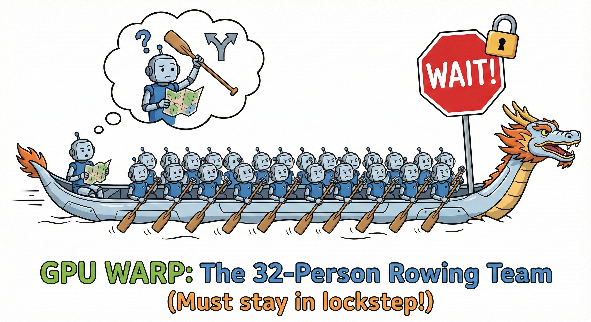
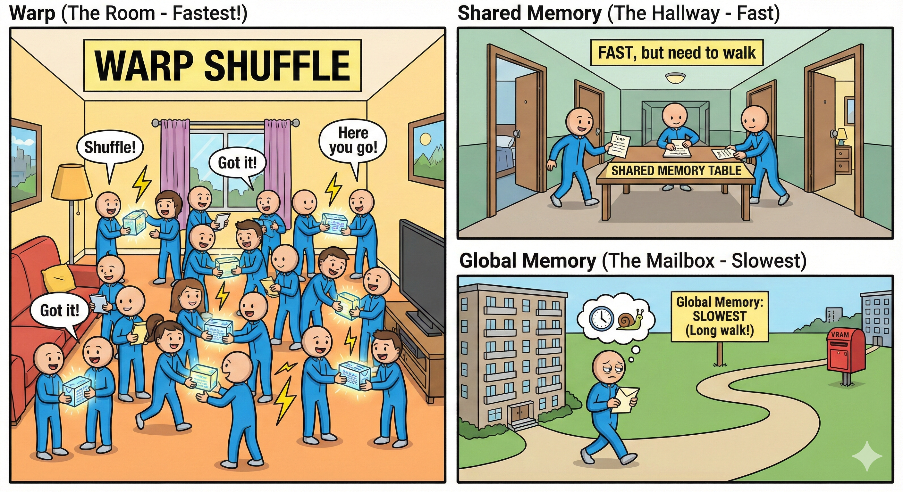

Let’s hit **warp speed!** 🚀💨

### 🛶 The GPU Warp: The 32-Person Rowing Team

A **Warp** is the smallest unit of execution on a GPU. It’s a group of **32 threads** 🧵 that are physically "married" at the hardware level to execute the exact same instruction at the exact same time. ⏱️




**To explain it simply:**
Think of a warp like a **32-person rowing team** 🚣‍♂️ where everyone must move their oars in perfect lockstep. 🔄

* **The Goal:** Total synchronization! 🎯
* **The Problem:** If even **one** person needs to do something different (like an `if/else` branch in your code 🔀), the **whole boat** has to wait! 🛑
* **The Secret:** Keeping their work identical and uniform is the key to unlocking massive GPU performance! 💎⚡

---

**Would you like me to show you how "Warp Divergence" (when the rowers get out of sync) can slow down your code?**




---

### 🔍 The Two Ways to be "Warped"

In GPU programming, there are two layers of "groups." This functional code shifts the work from the **Thread's hand** to the **Warp's team.**

#### 1. The SIMD Way (Internal Vectorization)

* **Your previous code:** Used `a.load[simd_width]`.
* **The Action:** One thread acts like a "Super Worker" with 4 arms, grabbing 4 apples at once.
* **The Result:** The thread adds its own 4 apples, then talks to the warp.

#### 2. The Warp Way (The Functional Code)

* **This code:** Uses `a.load[1]`.
* **The Action:** One thread acts like a "Normal Worker" with 1 arm. It grabs exactly **one** apple.
* **The "SIMD" Secret:** Because a Warp consists of 32 threads moving in lockstep, the hardware naturally performs a **SIMD-32** operation across the whole warp.

---

### 🏗️ Hardware-Software Alignment

Mojo is designed to map directly to the physical reality of modern GPUs (NVIDIA & AMD).

* **SIMT Execution:** All "Lanes" (threads) in a Warp execute the same instruction at the exact same heartbeat.
* **Zero-Sync Cost:** Because the hardware moves in lockstep, you don't need explicit barriers (`sync_threads`) to talk to neighbors within a Warp.
* **Cross-Architecture Support:** Using `WARP_SIZE` allows your code to automatically adapt to **NVIDIA (32 threads)** or **AMD (32/64 threads)**.

---

- > When you look at your code, ask these three "Warp Questions":

- > Alignment: Is my data size a multiple of 32? (Avoid "Masked" empty seats).

- > Coalescing: Are my 32 threads reading from a continuous block of memory? (The "Gulp").

- > Communication: Can I use a warp_shuffle instead of writing to memory and reading it back? (The "Whisper").

```mojo
from math import ceildiv
from gpu import thread_idx, block_idx, block_dim, barrier, lane_id
from gpu.host import DeviceContext, HostBuffer, DeviceBuffer
from gpu.warp import sum as warp_sum, WARP_SIZE
from gpu.memory import AddressSpace
from algorithm.functional import elementwise
from layout import Layout, LayoutTensor
from utils import IndexList
from sys import argv, simd_width_of, size_of, align_of
from testing import assert_equal
from random import random_float64
from gpu.host.compile import get_gpu_target

comptime SIZE = WARP_SIZE
comptime BLOCKS_PER_GRID = (1, 1)
comptime THREADS_PER_BLOCK = (WARP_SIZE, 1)  # optimal choice for warp kernel. 
comptime dtype = DType.float32
comptime SIMD_WIDTH = simd_width_of[dtype, target = get_gpu_target()]()
comptime in_layout = Layout.row_major(SIZE)
comptime out_layout = Layout.row_major(1)
```

## Dot Product - Traditional Approach (without warp)

```mojo

fn traditional_dot_product[
    in_layout: Layout, out_layout: Layout, size: Int
](
    output: LayoutTensor[dtype, out_layout, MutAnyOrigin],
    a: LayoutTensor[dtype, in_layout, ImmutAnyOrigin],
    b: LayoutTensor[dtype, in_layout, ImmutAnyOrigin],
):
    """
    This is the complex approach from p12_layout_tensor.mojo - kept for comparison.
    """
    shared = LayoutTensor[
        dtype,
        Layout.row_major(WARP_SIZE),
        MutAnyOrigin,
        address_space = AddressSpace.SHARED,
    ].stack_allocation()
    global_i = Int(block_dim.x * block_idx.x + thread_idx.x)
    local_i = Int(thread_idx.x)

    if global_i < size:
        shared[local_i] = (a[global_i] * b[global_i])
    else:
        shared[local_i] = 0.0

    barrier()

    stride = WARP_SIZE // 2
    while stride > 0:
        if local_i < stride:
            shared[local_i] += shared[local_i + stride]
        barrier()
        stride //= 2

    if local_i == 0:
        output[global_i // WARP_SIZE] = shared[0]

```

# WARP it!

1. **SIMD-First (Your Initial Iteration):** * **The Thread Does Heavy Lifting:** Each thread grabs 4 elements (SIMD-4), multiplies them, and uses `reduce_add()` *locally* within its own register.
* **The Warp Does Less Work:** Because 1 thread handles 4 elements, a 32-element problem only needs **8 threads**. The `warp_sum` only has to combine 8 values.
* **Efficiency:** High (less thread management).

```mojo
fn simple_warp_dot_product[
    in_layout: Layout, out_layout: Layout, size: Int
](
    output: LayoutTensor[dtype, out_layout, MutAnyOrigin],
    a: LayoutTensor[dtype, in_layout, ImmutAnyOrigin],
    b: LayoutTensor[dtype, in_layout, ImmutAnyOrigin],
):
    global_i = Int(block_dim.x * block_idx.x + thread_idx.x)

    var partial_product: Scalar[dtype] = 0
    if global_i < size:
        # Each thread computes one partial product using vectorized approach as values in Mojo are SIMD based
        partial_product = (a[global_i] * b[global_i]).reduce_add()  # i.e  take 4 element at a time (simd width) - sum them..  32 elements is multiplied and reduced/crushed to 8 elements. After which it needs to be summed again. 

    # warp_sum() replaces all the shared memory + barriers + tree reduction
    total = warp_sum(partial_product)

    # Only lane 0 writes the result (all lanes have the same total)
    if lane_id() == 0:
        output[global_i // WARP_SIZE] = total

```

---

**Warp Level (The Magic):**
* Even though you only used 8 threads, they are part of a **Warp** (which has 32 slots or "Lanes").
* You call `warp_sum()`.
* The GPU hardware triggers those **Shuffle Wires** 
* **The Swap:** Thread 0 talks to Thread 1, Thread 2 talks to Thread 3... and so on.
* **Result:** In just a few clock cycles, the 8 partial sums are crushed into **one single total**.

Mojo replaces complex, manual "Tree Reductions" with high-performance primitives:

| Traditional Pattern | Mojo Warp Primitive | Hardware Action |
| --- | --- | --- |
| **Tree Reduction** | `sum(value)` | Binary tree sum via internal wires. |
| **Prefix Scans** | `prefix_sum(value)` | Cumulative sum across lanes. |
| **Data Exchange** | `shuffle_idx()`, `shuffle_down()` | Direct register-to-register "whispers." |

---

### 🛠️ Core Warp Primitives (`gpu.warp`)

Here is how you use the "Superpowers" inside your kernels:

* **`lane_id()`**: "Who am I?" (Returns 0–31).
* **`sum(val)`**: Adds the `val` from every thread into one total.
* **`shuffle_down(val, delta)`**: Grabs a value from a neighbor "down" the line.

### 🧠 Why this is "Hardware Accelerated Magic"

* **No Memory Needed:** The 8 threads don't have to write their results to a "table" (Shared Memory) and then read them back. The numbers stay in the **Registers** and move across the **Shuffle Bus**.
* **The "Inactive" Lanes:** Even though you only have 8 threads working, the `warp_sum` hardware still works on all 32 lanes. Lanes 8 through 31 just contribute "0" to the sum. The hardware doesn't care; it treats the whole warp as one unit.

---

### 🌊 Warp-Only: The "Strength in Numbers" Variation

In this version, we move the workload away from the individual thread and give it all to the **Warp Team**. 🤝

* **🧵 The Thread Does Light Lifting:** Each thread is a "Minimalist" 🧘. Instead of a big package, it grabs exactly **1 element** 💎. No local SIMD reduction, just one simple load and one product.
* **🏟️ The Warp Does All the Work:** To solve 32 elements, you wake up **32 threads** 📣. Every single thread calculates its own product and then immediately throws it into the **32-lane `warp_sum**` 🌪️.
* **⚖️ Efficiency:** You have **Lower Thread Efficiency** (each worker is only using one hand ✋), but you are using the **Full Width** of the hardware **Warp Shuffle** ⚡.

---

```mojo
fn functional_warp_dot_product[
    layout: Layout,
    out_layout: Layout,
    dtype: DType,
    simd_width: Int,
    rank: Int,
    size: Int,
](
    output: LayoutTensor[mut=True, dtype, out_layout, MutAnyOrigin],
    a: LayoutTensor[mut=False, dtype, layout, MutAnyOrigin],
    b: LayoutTensor[mut=False, dtype, layout, MutAnyOrigin],
    ctx: DeviceContext,
) raises:
    @parameter
    @always_inline
    fn compute_dot_product[
        simd_width: Int, rank: Int, alignment: Int = align_of[dtype]()
    ](indices: IndexList[rank]) capturing -> None:
        idx = indices[0]

        # Each thread computes one partial product
        var partial_product: Scalar[dtype] = 0.0
        if idx < size:
            a_val = a.load[1](idx, 0)
            b_val = b.load[1](idx, 0)
            partial_product = a_val * b_val
        else:
            partial_product = 0.0

        # Warp magic - combines all WARP_SIZE partial products!
        total = warp_sum(partial_product)

        # Only lane 0 writes the result (all lanes have the same total)
        if lane_id() == 0:
            output.store[1](idx // WARP_SIZE, 0, total)

    # Launch exactly size == WARP_SIZE threads (one warp) to process all elements
    elementwise[compute_dot_product, 1, target="gpu"](size, ctx)
```

### Helpers

```mojo
fn expected_output[
    dtype: DType, n_warps: Int
](
    expected: HostBuffer[dtype],
    a: DeviceBuffer[dtype],
    b: DeviceBuffer[dtype],
) raises:
    with a.map_to_host() as a_host, b.map_to_host() as b_host:
        for i_warp in range(n_warps):
            i_warp_in_buff = WARP_SIZE * i_warp
            var warp_sum: Scalar[dtype] = 0
            for i in range(WARP_SIZE):
                warp_sum += (
                    a_host[i_warp_in_buff + i] * b_host[i_warp_in_buff + i]
                )
            expected[i_warp] = warp_sum

fn rand_int[
    dtype: DType, size: Int
](buff: DeviceBuffer[dtype], min: Int = 0, max: Int = 100) raises:
    with buff.map_to_host() as buff_host:
        for i in range(size):
            buff_host[i] = Int(random_float64(min, max))


fn check_result[
    dtype: DType, size: Int, print_result: Bool = False
](actual: DeviceBuffer[dtype], expected: HostBuffer[dtype]) raises:
    with actual.map_to_host() as actual_host:
        if print_result:
            print("=== RESULT ===")
            print("actual:", actual_host)
            print("expected:", expected)
        for i in range(size):
            assert_equal(actual_host[i], expected[i])
```

### Setup

```mojo
print("SIZE:", SIZE)
print("WARP_SIZE:", WARP_SIZE)
print("SIMD_WIDTH:", SIMD_WIDTH)
comptime n_warps = SIZE // WARP_SIZE
ctx =  DeviceContext()

out = ctx.enqueue_create_buffer[dtype](n_warps)
out.enqueue_fill(0)

out_2 = ctx.enqueue_create_buffer[dtype](n_warps)
out_2.enqueue_fill(0)

out_3 = ctx.enqueue_create_buffer[dtype](n_warps)
out_3.enqueue_fill(0)

a = ctx.enqueue_create_buffer[dtype](SIZE)
a.enqueue_fill(0)
b = ctx.enqueue_create_buffer[dtype](SIZE)
b.enqueue_fill(0)
expected = ctx.enqueue_create_host_buffer[dtype](n_warps)
expected.enqueue_fill(0)

out_tensor = LayoutTensor[dtype, out_layout, MutAnyOrigin](out)
out_tensor_2 = LayoutTensor[dtype, out_layout, MutAnyOrigin](out_2)
out_tensor_3 = LayoutTensor[dtype, out_layout, MutAnyOrigin](out_3)

a_tensor = LayoutTensor[dtype, in_layout, ImmutAnyOrigin](a)
b_tensor = LayoutTensor[dtype, in_layout, ImmutAnyOrigin](b)

with a.map_to_host() as a_host, b.map_to_host() as b_host:
                for i in range(SIZE):
                    a_host[i] = i
                    b_host[i] = i
```

```text
SIZE: 32
WARP_SIZE: 32
SIMD_WIDTH: 4
```

### Call traditional_dot_product

```mojo
ctx.enqueue_function_checked[
    traditional_dot_product[
        in_layout, out_layout, SIZE
    ],
    traditional_dot_product[
        in_layout, out_layout, SIZE
    ],
](
    out_tensor,
    a_tensor,
    b_tensor,
    grid_dim=BLOCKS_PER_GRID,
    block_dim=THREADS_PER_BLOCK,
)

expected_output[dtype, n_warps](expected, a, b)
check_result[dtype, n_warps, True](out, expected)
ctx.synchronize()
```

```text
=== RESULT ===
actual: HostBuffer([10416.0])
expected: HostBuffer([10416.0])
```

### Call simple_warp_dot_product

```mojo
ctx.enqueue_function_checked[
            simple_warp_dot_product[in_layout, out_layout, SIZE],
            simple_warp_dot_product[in_layout, out_layout, SIZE],
        ](
            out_tensor_2,
            a_tensor,
            b_tensor,
            grid_dim=BLOCKS_PER_GRID,
            block_dim=THREADS_PER_BLOCK,
        )


check_result[dtype, n_warps, True](out_2, expected)
ctx.synchronize()
```

```text
=== RESULT ===
actual: HostBuffer([10416.0])
expected: HostBuffer([10416.0])
```

### Call functional_warp_dot_product

```mojo
functional_warp_dot_product[
                    in_layout, out_layout, dtype, SIMD_WIDTH, 1, SIZE
                ](out_tensor_3, a_tensor, b_tensor, ctx)


check_result[dtype, n_warps, True](out_3, expected)
ctx.synchronize()
```

```text
=== RESULT ===
actual: HostBuffer([10416.0])
expected: HostBuffer([10416.0])
```

### ⚠️ The Performance Killer: Divergence

The GPU is a "Team Sport." If the team splits up, performance drops off a cliff.

* **Divergence:** Occurs when an `if/else` statement forces half the Warp to go left and the other half to go right.
* **The Cost:** The GPU cannot run both paths at once. It runs Path A while Path B **waits idle**, then runs Path B. Your 2x speedup just became 0x.
* **Convergence:** The goal is to get all lanes to "reunite" as fast as possible to continue in parallel.


---